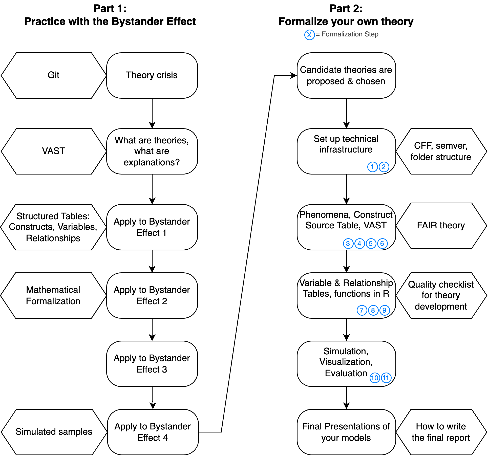
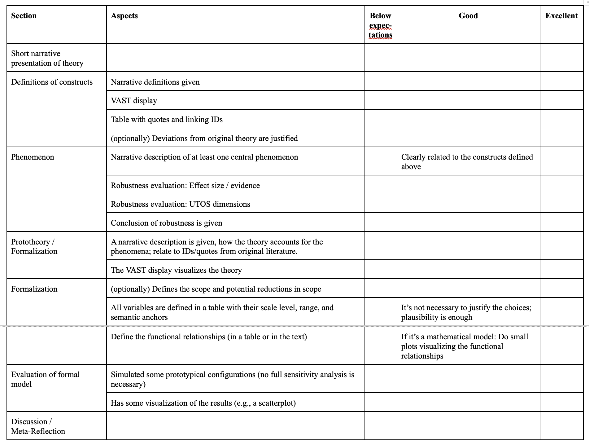

## Goals 

::: {.incremental}
- Learn skills and tools that aid theory development
  - Technical: Git, semantic versioning, make a theory object citeable...
  - Conceptual: 
    - Visual Argument Structure Tool (VAST)
    - Theory Construction Methodology (TCM)
    - FAIR theories
- Practice theory formalization with multiple examples
- Understand the advantages and barriers of formal modeling
  - High likelihood of "failure"!
- "Hacker space" for theory building: We all are learners.
:::

##

{.img-full}

## Content

Three types of activities:

1. **Lectures**: Gain knowledge
2. **Skills**: Learn new tools
3. **Workshop**: Apply tools and knowledge to a research question

All slides, homework instructions, etc. are on this website:
[https://nicebread.github.io/FOMO-Psy/](https://nicebread.github.io/FOMO-Psy/)

::: {.callout-note}
Note: GitHub (where the website is hosted) uses caching. 
That means if I update the website, you will *only* see the updates if you 
actively reload it with Ctrl+R (Win/Linux) or Cmd-R (Mac).

All homework will be submitted to a private Git repo.
:::

## Formalia & Expectations

- 9 ECTS credit points
  - ≙ 3 lectures with exam
  - ≙ 12h expected time investment per week (in person course + homework)
- Do your weekly homework
- Participate actively in the course
- Write your final report


## Hausarbeit
### Aufbau

::: {.smaller}
Da wir keine klassisch empirische Arbeit schreiben, sondern eine Theorie formalisieren, sieht der Aufbau der Hausarbeit etwas anders aus; z.B. so:

::: {.smallest}
0. Abstract
1. Define the Objective  
2. Identification of Relevant Phenomena
3. Brief Verbal Introduction to the Selected Theory  
4. Present Core Constructs of the Theory
5. Formulation of the (Proto-)Theory  
6. Development of a Formal Model  
7. Evaluation of the Formal Model  
8. Discussion: Meta-Reflection  
:::

Mehr Details im Laufe des Seminars. Wir arbeiten bereits im Seminar auf ihre konkrete Hausarbeit hin.
:::

## Hausarbeit
### Formalia

::: {.smaller}
- Schriftgröße 12pt, Zeilenabstand 1.5x
- 15.000 Zeichen +/- 20% (Zählung inkl. Leerzeichen; ohne Deckblatt, Referenzen und Anhänge)
- Deckblatt: Titel, Datum, Name, Matrikel-Nr., Name der Veranstaltung
- Wenn Sie in `papaja`/`Rmarkdown`/`apaquarto` schreiben:
  - das exportierte PDF von der Formatierung her gut so wie es ist (Sie brauchen nicht das Deckblatt, Zeilenabstand etc. anpassen).
  - Schreiben Sie Datum, Matrikel-Nr. und Name der Veranstaltung in die Author Notes.
- Kein Inhaltsverzeichnis
- Mindestens 5 Publikationen zitieren
- Zitate & Literaturverzeichnis nach [APA-Richtlinien](http://owl.english.purdue.edu/owl/resource/664/01/) (6. oder 7. Version)
:::


## Hausarbeit
### Abgabe 

- Als PDF-Datei per Email an den Dozenten – Empfang wird bestätigt
- Abgabetermin: Wird noch bekannt gegeben; ca. 3 Wochen vor Beginn des nächsten Semesters (d.h. Mitte März im WS bzw. Mitte Sept. im SS)
- Zwei Versionen einreichen:
  - Vollständige Version (Dateiname: IhrNachname_Empra_Jahr.pdf) – z.B.: „Schmid_Empra_2024.pdf“
  - Anonymisierte Version, bei welcher der Name auf dem Deckblatt gelöscht ist (Dateiname: Matrikelnummer_Empra_Jahr.pdf)
    - Diese Version wird benotet.
    - Dateiname z.B.:„98234034_Empra_2024.pdf“
    - Anonyme Version in `papaja`: im YAML-Header  `mask: yes` angeben (siehe [Anleitung](https://frederikaust.com/papaja_man/r-markdown-components.html))
    - Anonyme Version in `apaquarto`: im YAML-Header  `mask: true` angeben (siehe [Anleitung](https://wjschne.github.io/apaquarto/writing.html?q=anonym#masked-citations-for-anonymous-peer-review))


## Hausarbeit
### Benotung

- Wer anwesend ist, aktiv mitmacht und eine sinnvolle Hausarbeit abgibt bekommt eine (sehr) gute Note
- Es geht um:
  - das Engagement
  - die Auseinandersetzung mit den Tools und der Materie der Theoriebildung
  - eine kritische Reflexion des Prozesses
- Wenn die Theorie, die man sich vorgenommen hat, einfach keine Formalisierung hergibt, dann ist das ein Problem der Theorie (und keine Fehlleistung auf Seite der Studierenden). In dem Fall ...
  - reflektieren, warum es nicht funktioniert hat
  - was wäre notwendig gewesen, um weiterzukommen
  - die gemachten Schritte und Hürden dokumentieren


## Hausarbeit
### Bewertungsschema (aktueller Entwurf)



## A note on AI
### Train Your Brain, Don’t Outsource It

::: {.incremental}
- Experience since 2024: Declining skills and attention span.
- Create space for **deep thinking**, intellectual struggle, and social exchange.
- Treat your brain like a **muscle**: *upskilling, not deskilling*.
  - You wouldn’t bring a forklift to the gym.
- The goal is **not maximum efficiency** or simply “getting things done.”
- The goal is **lasting, personal learning** — not replacing your own thinking with a shortcut.
:::

::: {.notes}
Meine Erfahrungen: Sinkende Fähigkeiten in Statistikklausur und Sommerschule. Eigene Position: ambivalent - nutze es selber täglich. Bin froh, dass ich jahrzehntelang selber die Dinge durchdacht und gelernt habe - ich kann noch die Qualität beurteilen. Sind wir die letzte Generation?
:::

## A note on AI
### What this course is for

Our seminar is...

- a **bootcamp for your thinking skills**
- a **space for social exchange**
- focused on the **process of learning**, not just the output

> This only works if, at least during certain phases,  
> **we make this an AI-free space.**   
> If we use AI, we use it as a tutor or reviewer, not as a crutch or shortcut.


## Eigenständigkeitserklärung (deutsch)
 
> Hiermit versichere ich, dass ich die Arbeit selbständig verfasst habe. Die Stellen der Arbeit, die anderen Werken dem Wortlaut oder dem Sinn nach entnommen sind, habe ich in jedem einzelnen Fall unter Angabe der Quelle kenntlich gemacht. Dies gilt auch für die wörtliche Übernahme von fremdsprachlichen Textpassagen, die mittels KI-Tools übersetzt wurden. Hier habe ich die originalsprachliche Quelle sowie das KI-Tool zur Übersetzung genannt (z.B. “Autor, Jahr, Seitenzahl, Übersetzung dieser englischsprachigen Originalquelle mit deepL”). Zeichnungen, Kartenskizzen und bildliche Darstellungen, soweit vollständig aus einem vorhandenen Werk übernommen oder für die Zwecke dieser Arbeit adaptiert, habe ich mit Quellenangaben versehen. 
> 
> KI-generierte bildliche Darstellungen habe ich als solche kenntlich gemacht und das verwendete Tool genannt.
> 
> KI-generierten Text und Analyse-Code habe ich, soweit in der Arbeit verwendet, überprüft und eigenständig nach Bedarf bearbeitet.
> 
> Ich übernehme die volle Verantwortung für den Inhalt dieser Arbeit und versichere, dass ich die eingereichte Arbeit ohne Rückgriff auf eine generative KI angemessen erklären, verteidigen und rekonstruieren könnte.

::: footer
Leitlinien für die Nutzung von KI in Lehre und Prüfungen am Department Psychologie: <https://doi.org/10.5281/zenodo.20606211>
:::

## Eigenständigkeitserklärung (english)

> I hereby declare that I have written this work independently. Any passages taken from other works, whether verbatim or in substance, have been clearly identified and appropriately referenced in every instance. This also applies to direct quotations from sources written in other languages that have been translated using AI tools. In such cases, I have cited both the original-language source and the AI tool used for translation (e.g., “Author, Year, Page Number, translation of the original German- language source using DeepL”). Any drawings, maps, figures, or visual representations that have been reproduced from existing works or adapted for the purposes of this submission have been appropriately referenced. 
> 
> AI-generated images have been clearly identified as such, and the tool used has been named. 
> 
> Any AI-generated text or analysis code used in this work has been critically reviewed and, where necessary, revised by me. 
> 
> I take full responsibility for the content of this work and confirm that I could reasonably explain, defend, and reconstruct it without relying on a generative AI tool.

::: footer
Leitlinien für die Nutzung von KI in Lehre und Prüfungen am Department Psychologie: <https://doi.org/10.5281/zenodo.20606211>
:::


## No video recordings, no smart glasses

:::: {.columns}
::: {.column width='60%'}
::: {.vcenter}
- No audio or video recordings without prior agreement.
- Wearing smart glasses with a recording function (e.g. Ray-Ban Meta) is not permitted, regardless of whether the recording function is activated or not.
- In the event of a breach, you must delete any existing recordings and leave the event.
:::
:::

::: {.column width='40%'}
::: {.vcenter}

:::
:::
::::

::: footer
Under §5(1)(4) of the LMU’s house rules, video and audio recordings (including those made solely for private purposes) are only permitted with my authorisation as the event organiser. **I do not grant such authorisation.** As the event organiser, I am responsible for enforcing the house rules for this room in accordance with §2(2)(2) of the house rules.
:::


<!-- Footer insert below -->
```{r child="../../common/lastslide.qmd"}
```
