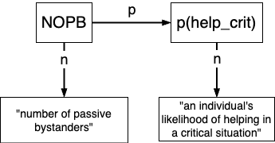
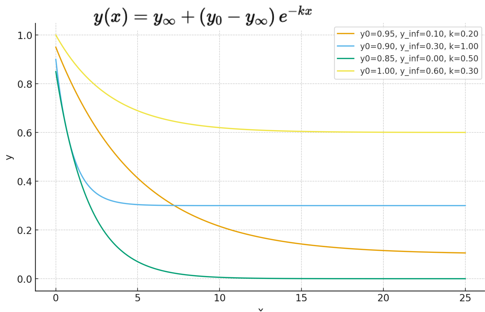
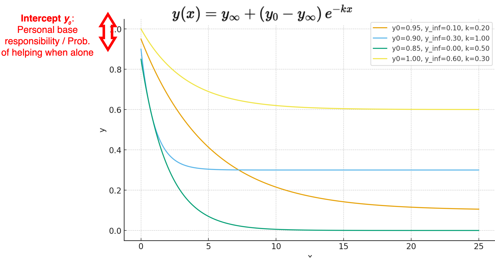
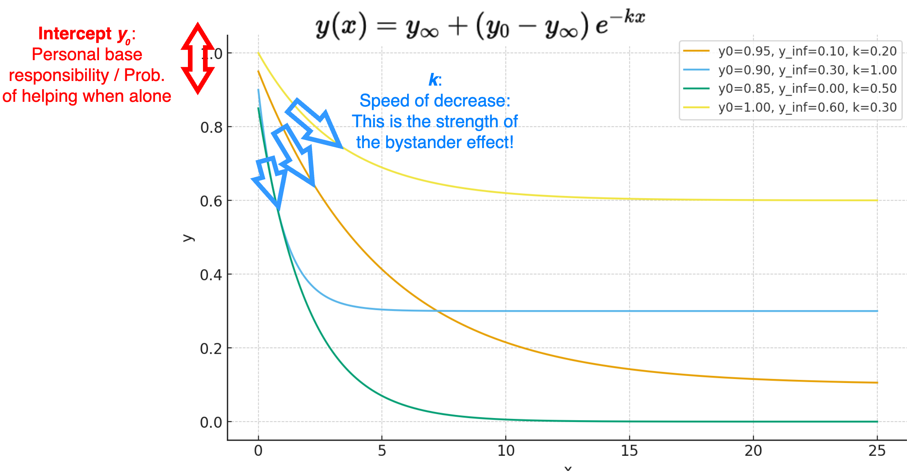
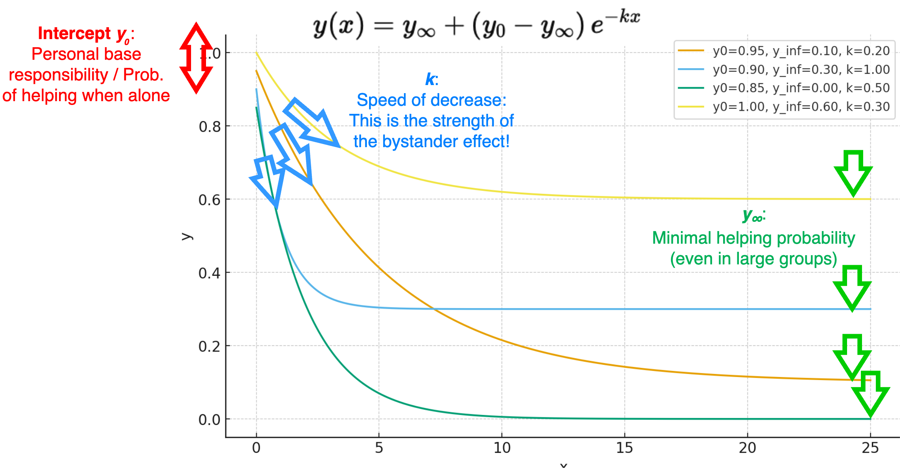
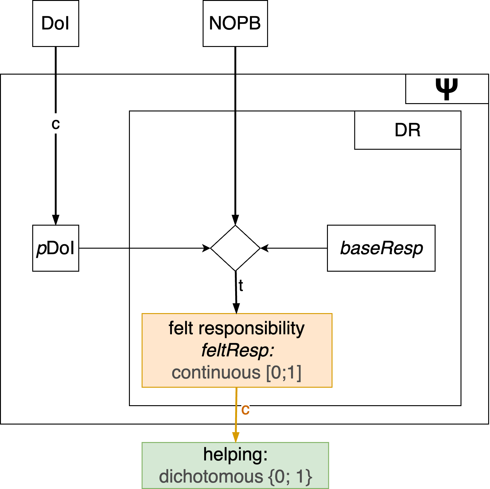
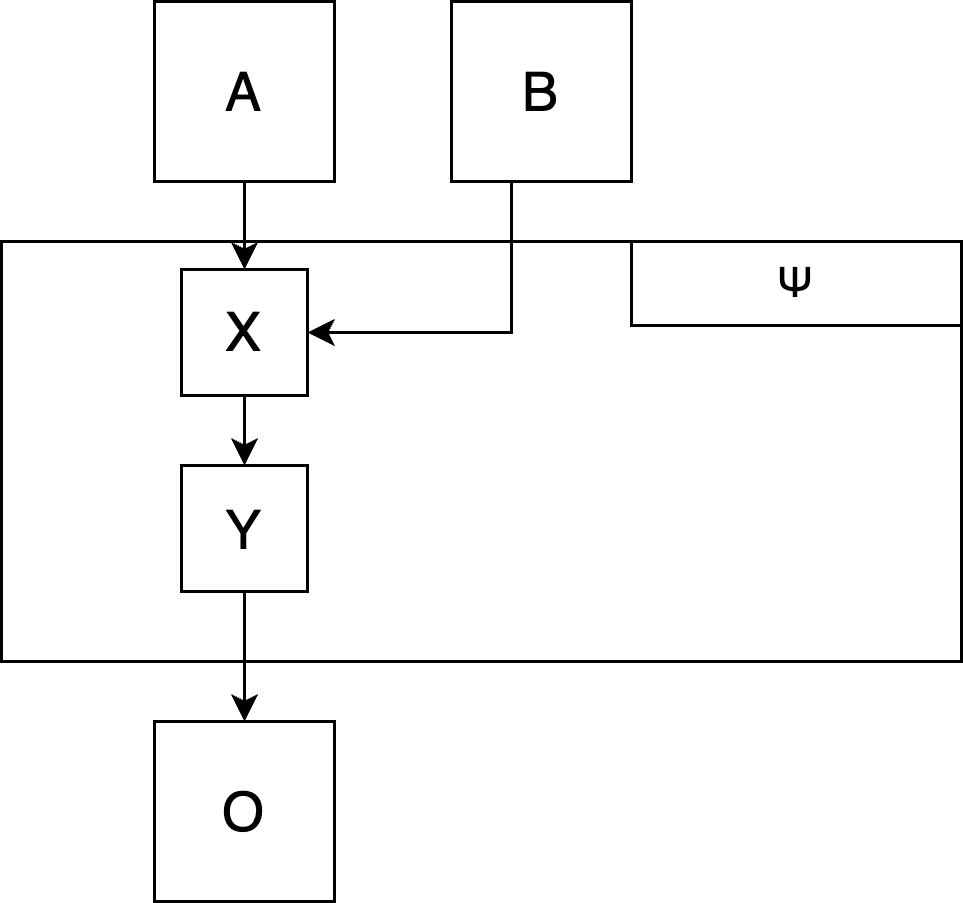
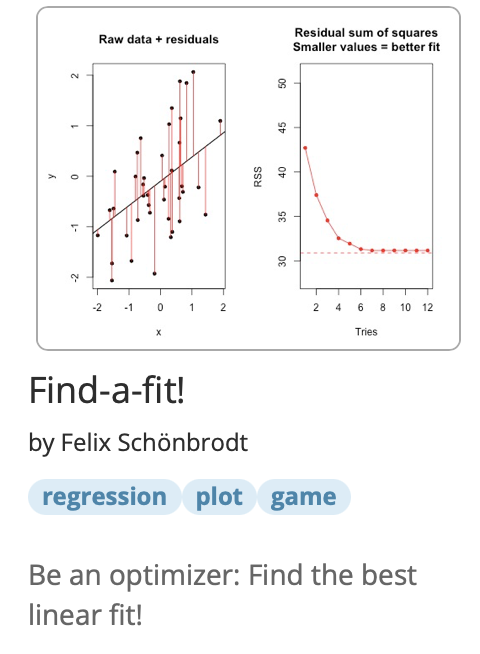
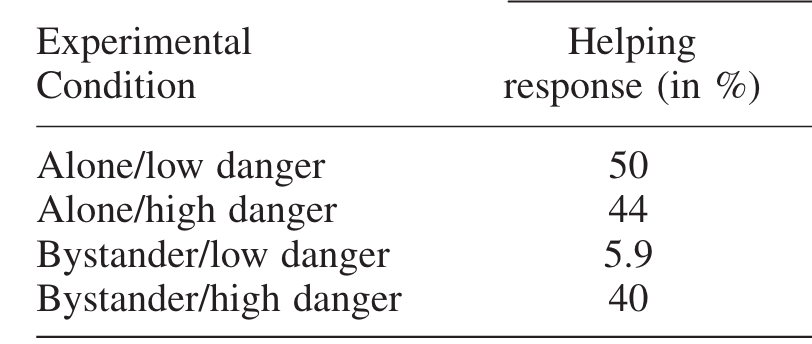

```{r setup, include=FALSE}
# Global chunk options
knitr::opts_chunk$set(
  fig.align = "center",   # Center-align figures
  echo = FALSE,           # Do not display code by default
  fig.width = 10,          # Default figure width
  fig.height = 5          # Default figure height
)
set_par <- function() {
  par(cex = 2, cex.main=1.2,  mar = c(4, 4, 1.7, 1))  # Bottom, left, top, right margins
}
```


##
{height='450' style='filter: drop-shadow(6px 6px 8px #555555);'}

::: {.fragment}
::: {.callout-tip title="**Answer: -136.7**"}
:::
:::


# Step 1: Define variables

## Define variables
### How deep is your love?
Define a variable for each construct* of the VAST display. These can be *measured* variables or *unmeasured* (mediating) variables. 

You can either refer to an actual measurement procedure or simply define a variable. In both cases you should explicitly define the following properties:

- *variable name* (i.e., to which concept in your VAST display does it refer?),
- *scale level* (categorical, ordinal, interval scale), 
- *range* of possible values (e.g., 0 ... 1), 
- *semantic anchors* (e.g., 0 = "complete absence", 1 = "maximal possible value")

::: {.footer}
\* only uni-dimensional constructs, not higher-order concepts
:::

## Define variables
### Some guiding questions and heuristics

- Type of variable: continuous, dichotomous, ordinal, categorical?
<!-- - Scale level of measurement ([Stevens's typology](https://en.wikipedia.org/wiki/Level_of_measurement)): <br>Nominal &rarr; Ordinal &rarr; Interval &rarr; Ratio -->
- Is the variable naturally bounded? On both sides or only one?
- How can the numbers be interpreted?
  - Natural/objective scale (e.g. physical distance)
  - As standardized *z*-scores?
  - Normalized to a value between 0 and 1? Or rather -1 to 1?
  - Can we find an empirical or semantic calibration?
    - Just noticable difference
    - 100 = "largest realistically imaginable quantity of that variable"
  
::: {.notes}
Psychological ("internal") variables could range from $-\infty$ to $+\infty$, and then are transformed to bounded manifest responses when they leave the $\Psi$-box (cf. item response theory)
:::


##  Group work (15 min.): Specify variables

::: {.smaller}
In the Google doc (below your *Construct Table*) fill in 2-3 exemplary variables from your bystander model in the *Variables Table*:

*Example:*

<div class="table-grid smaller">
| Construct in VAST display              | Shortname   | Type       | Range/values | Anchors                                                           |
| -------------------------------------- | ----------- | ---------- | ------------ | ----------------------------------------------------------------- |
| Affective tone of instruction          | aff_tone    | Continuous | [-1; 1]      | -1 = maximally negative<br>0 = neutral<br>+1 = maximally positive |
| Anxiety                                | anxiety     | Continuous | [0; 1]       | 0 = no anxiety<br>1 = maximal anxiety                             |
| Kohlberg's Stages of Moral Development | moral_stage | Ordinal    | {1; 2; 3}    | 1=Pre-conventional<br>2=Conventional<br>3=Post-Conventional       |
| ...                                    |             | ...        | ...          | ...                                                               |
</div>

:::
::: {.smallest}
Note: This resembles a **codebook**; but for theoretical variables, not only for measured variables.
As a heuristic, list **all concepts that are not higher-order concepts** (because these usually have no single numerical representation).
:::

# Step 2: Define functional relationships between variables

##  Group work (10 min.)
### Sketch a first functional relationship on paper

::::{.columns}
::: {.column width='60%'}
We want to model the following **phenomenon** (a specific version of the bystander effect):

::: {.smaller}
1. Without other people present, the tendency (probability or frequency) that a person helps a victim is high.
2. The tendency of helping a victim decreases monotonically with the number of other people (bystanders) present.
3. The tendency of helping a victim never drops to 0.
:::

:::
::: {.column width='40%'}

:::
::::

**Task**: Sketch a first functional relationship that could model this phenomenon. Use the variables you defined in the previous step (including their labels and ranges).


## Step 2: Define functional relationships between variables
Every causal path needs to be implemented as a mathematical function, where the dependent variable/output $y$ is a function of the input variable(s) $x_i$.

$y = f(x_1, x_2, ..., x_i)$

This can, for example, be a linear function, $y = \beta_0 + \beta_1x_1$.

## Step 2: Define functional relationships between variables
### Fixed and free parameters

::: {.smaller}
$\color{red} y = \color{forestgreen} \beta_0 \color{black} + \color{forestgreen} \beta_1 \color{blue} x$ 
<br>→ $\color{red} y$ = output variable, $\color{forestgreen} \beta$s = parameters, $\color{blue} x$ = input variable.

Two types of parameters:

:::
::: {.smallest}
- **Fixed parameters**: Parameters that are chosen a priori and do not change in the light of empirical data. Their values are based on previous research, theory, or external information (such as properties of the world).
- **Free parameters**: Can be adjusted to optimize the fit of the model to data. They are *estimated* from empirical data.
:::

::: {.callout-note}
Virtually all parameters (except natural constants) could be imagined as being free. It is a *choice* to fix some of them in order to simplify the model.
In our course, we do not attempt to estimate parameters from data. Instead, we will *explore* the behavior of our models under different parameter settings (i.e., a *sensitivity analysis*).
:::


## Step 2: Define functional relationships between variables
### Fixed and free parameters

Fixing a parameter: $\color{forestgreen} \beta_0 \color{black} = 1 \rightarrow \color{red} y = \color{forestgreen} 1 \color{black} + \color{forestgreen} \beta_1 \color{blue} x$ 

That means, the slope $\color{forestgreen} \beta_1$ still can vary, but the intercept is fixed to 1.

::: {.smaller}
Free parameters give **flexibility** to your function: If you are unsure about the exact relationship between two variables, you can estimate the best-fitting parameters from the data.

For example, sometimes a theory specifies the general functional form of a relationship (e.g., "With increasing $x$, $y$ is monotonously decreasing"), but does not tell how fast this decrease happens, where $y$ starts when $x$ is minimal, etc. These latter decisions are then made by the free parameters. 
:::


##  Discussion
### Sketch a first functional relationship on paper

- Which aspects of your sketched function could be free parameters? Describe them in plain language.
- Draw a couple of alternative plots that (a) follow the same functional form and (b) also fullfill the criteria of the phenomenon. 
- What is the semantic meaning of the free parameters?


## A 3-parameter exponential decay function {transition="fade"}



## A 3-parameter exponential decay function {transition="fade"}



## A 3-parameter exponential decay function {transition="fade"}



## A 3-parameter exponential decay function {transition="fade"}




<!-- ChatGPRT /Wolfram Alpha prompt

Create a function that maps values of x (which can go from 0 to infinity) to values of y (which goes from 0 to 1). It should start at a high value of y (this starting point should be free parameter of the function), decreases monotonically, and levels out at a certain value >= 0 (which should also be a free parameter). A third free parameter is the speed of the decreasing.
Provide plots for multiple instances of this function family.

 -->

## Tool: The logistic function family

As a linear function is unbounded, it can easily happen that the computed $y$ exceeds the possible range of values.

If $y$ has defined boundaries (e.g., $[0; 1]$), a logistic function can bound the values between a lower and an upper limit (in the basic logistic function, between 0 and 1):

$y = \frac{1}{1 + e^{-x}}$

```{r}
set_par()

# Define the logistic function
logistic <- function(x) {
  1 / (1 + exp(-x))
}

# Generate a sequence of x values
x_values <- seq(-10, 10, by = 0.1)

# Calculate y values using the logistic function
y_values <- logistic(x_values)

# Create the plot
plot(x_values, y_values, type = "l", col = "blue", xlab = "x", ylab = "y", yaxt = "n")
axis(2, at = c(0, 0.5, 1), labels = c("0", "0.5", "1"))
```


## Tool: The logistic function family

::: {.smaller}
With the 4PL* model from IRT, you can adjust the functional form to your needs, by:

- shifting the inflection point from left to right (aka. "item difficulty", parameter $d$)
- change the steepness of the S-shape (aka. "discrimination parameter", parameter $a$)
- Move the lower asymptote up or down (parameter $min$)
- Move the upper limit up or down (parameter $max$)
:::

$y = \text{min} + \frac{\text{max}-\text{min}}{1 + e^{a(d-x)}}$

```{r}
#| echo: true
logistic <- function(x, d = 0, a = 1, min = 0, max = 1) {
 min + (max - min)/(1 + exp(a * (d - x)))
}
```

::: footer
*4PL = 4-parameter logistic model
:::


## Tool: The logistic function family

::: {.smaller}
$y = \text{min} + \frac{\text{max}-\text{min}}{1 + e^{a(d-x)}}$  *(basic logistic function as dotted grey line)* 
:::

::: {.panel-tabset}
#### Shift on x-axis
```{r}
# Generate a sequence of x values
x_values <- seq(-5, 5, by = 0.1)

plot(x_values, logistic(x_values, d=2), type = "l", col = "blue", xlab = "x", ylab = "y", ylim=c(0, 1), main="d=2 ('difficulty')")
abline(v=2, col="red", lty="dashed")
lines(x_values, logistic(x_values), type = "l", lty="dotted", lwd=1.5, col = "darkgrey")
```
#### Steepness
```{r}
plot(x_values, logistic(x_values, a=0.6), type = "l", col = "blue", xlab = "x", ylab = "y", ylim=c(0, 1), main="a=0.6 (blue/flat); a=2 (green/steep)")
lines(x_values, logistic(x_values, a=2), type = "l", col = "darkgreen")
lines(x_values, logistic(x_values), type = "l", lty="dotted", lwd=1.5, col = "darkgrey")
```
#### Lower asymptote
```{r}
plot(x_values, logistic(x_values, min=0.2), type = "l", col = "blue", xlab = "x", ylab = "y", ylim=c(0, 1), main="min=0.2")
lines(x_values, logistic(x_values), type = "l", lty="dotted", lwd=1.5, col = "darkgrey")
```
#### Upper asymptote
```{r}
plot(x_values, logistic(x_values, max=0.7), type = "l", col = "blue", xlab = "x", ylab = "y", ylim=c(0, 1), main="max=0.7")
lines(x_values, logistic(x_values), type = "l", lty="dotted", lwd=1.5, col = "darkgrey")
```
:::


## Tool: The logistic function family

The `d`, `a`, `min`, and `max` parameters can be used to "squeeze" the S-shaped curve into the range of your variables. For example, if your $x$ variable is defined on the range $[0; 1]$, the following function parameters lead to a reasonable shift:

```{r}
#| echo: false
#| fig.width: 10
#| fig.height: 5

par(mfcol=c(1, 2))
set_par()
x_values <- seq(0, 1, length.out=100)
plot(x_values, logistic(x_values, d=0, a=1), type = "l", col = "blue", xlab = "x", ylab = "y", main="Default (d=0, a=1)", xlim=c(0, 1), ylim=c(0, 1), yaxt = "n", xaxt = "n")
axis(1, at = c(0, 0.5, 1), labels = c("0", "0.5", "1"))
axis(2, at = c(0, 0.5, 1), labels = c("0", "0.5", "1"))

plot(x_values, logistic(x_values, d=0.5, a=10), type = "l", col = "blue", xlab = "x", ylab = "y", main="d=0.5, a=10", xlim=c(0, 1), ylim=c(0, 1), yaxt = "n", xaxt = "n")
axis(1, at = c(0, 0.5, 1), labels = c("0", "0.5", "1"))
axis(2, at = c(0, 0.5, 1), labels = c("0", "0.5", "1"))
```

## Use the full mathematical toolbox

Of course, the logistic function is just a start - you can use the full toolbox of mathematical functions to implement your model!

::: {.callout-note}
These considerations about functional forms, however, are typically not substantiated by psychological theory or background knowledge - at least at the start of a modeling project. We choose them, because we are (a) acquainted to it, and/or (b) they are mathematically convenient and tractable.

Empirical evidence can inform both your choice of the functional form, and, in a model-fitting step, the values of the parameters.
:::


# Step 3: Implement the functions in R

## Excursus: Functions in R

- **What is a function?**
  - A reusable block of code designed to perform a specific task.
  - Can be an implementation of an actual mathematical function $y = f(x, z)$
  - But can also be a more complex operation, like reading a file, transforming data, or plotting a graph.
- **Why use functions?**
  - **Modularity:** Break down complex problems into manageable parts.
  - **Reusability:** Write once, use multiple times.
  - **Maintainability:** Easier to debug and update code.

## Anatomy of an R Function

```{r}
#| eval: false
#| echo: true
# Basic structure of a function
my_function <- function(arg1, arg2) {
  # Function body
  result <- arg1 + arg2
  return(result)
}
```
::: {.smaller}
- **Function name:** `my_function`
- **Parameters:** `arg1`, `arg2`
- **Body:** Code that defines what the function does
- **Return value:** return a specific value that has been computed in the function body with `return(return_variable)`. If no explicit `return()` statement is given, the last evaluated expression is returned by default.
:::

:::: {.columns .fragment}
::: {.column width='50%'}
```{r}
#| eval: false
#| echo: true
# use meaningful names

sum <- function(x, y) {
  S <- x+y
  return(S)
}
```
:::

::: {.column width='50%'}
```{r}
#| eval: false
#| echo: true
# short version: the last computation 
# is returned by default

sum <- function(x, y) {x+y}
```
:::
::::


## Creating and Using Your Own Function

1. **Define the Function:**

```{r}
#| eval: false
#| echo: true
get_y <- function(x) {
  y <- x^2
  return(y)
}
```

1. **Call the Function:**

```{r}
#| eval: false
#| echo: true
y <- get_y(x=2)
print(y)  # Output: 4
```

**Tips:**

::: {.smaller}
- Use meaningful and short names for functions and parameters.
- Keep functions focused on a single task.
- Document your functions with comments (ideally with the [`roxygen2`](https://roxygen2.r-lib.org) documentation standard)
- Atomic functions: Each `R` function implements exactly *one* functional relationship of your model.
:::

## Vectorization

For our simulations, we need to ensure that our functions can handle vector inputs^*^.
(Typically, all functions in R work are vectorized). This simply means, that arithmetic and logical operations are applied element-wise to all elements of a vector:


```{r}
#| echo: true
#| output-location: column-fragment
# define a vector
x <- 1:5
x
```
```{r}
#| echo: true
#| output-location: column-fragment
x * 2
```
```{r}
#| echo: true
#| output-location: column-fragment
x + 10
```
```{r}
#| echo: true
#| output-location: column-fragment
x^2
```
```{r}
#| echo: true
#| output-location: column-fragment
x > 3
```


::: {.footer}
^*^ Parameters of the functions typically are passed as a single value, not a vector.
:::


## Example with roxygen2 documentation

```{r}
#| eval: false
#| echo: true

#' Compute the updated expected anxiety
#'
#' The expected anxiety at any given moment is a weighted average of 
#' the momentary anxiety and the previous expected anxiety.
#'
#' @param momentary_anxiety The momentary anxiety, on a scale from 0 to 1
#' @param previous_expected_anxiety The previous expected anxiety, on a scale from 0 to 1
#' @param alpha A factor that shifts the weight between the momentary anxiety (alpha=1) 
#'              and the previous expected anxiety (alpha=0).
#' @return The updated expected anxiety, as a scalar on a scale from 0 to 1

get_expected_anxiety <- function(momentary_anxiety, previous_expected_anxiety, alpha=0.5) {
  momentary_anxiety*alpha + previous_expected_anxiety*(1-alpha)
}
```

::: {.smallest}
`roxygen2` comments start with `#'` and are placed directly above the function definition.

- The first line is the **title**
- The following lines (after a blank line) are the **description**
- Each **parameter** of the function is documented with `@param parameter_name Description`. Provide the range of possible values if applicable.
- The **return value** is documented with `@return Description`
:::


##  Exercise: Document our exponential decay function

Check out [roxygen2](https://roxygen2.r-lib.org) and document our exponential decay function with: 

- title
- description
- parameters
- return value.

```{r}
#| eval: false
#| echo: true
get_p_help <- function(NOPB, y_0, y_final, BSE_strength) {
  p_help <- y_final + (y_0 - y_final) * exp(-BSE_strength * NOPB)
  return(p_help)
}
```


## roxygen2 documentation: Solution

::: {.callout-tip title="Solution"}
```r
#' Compute the probability to help in an emergency situation
#' 
#' Calculate the probability of a bystander to help in a critical situation 
#' as a function of the number of passive bystanders. 
#' 
#' @param NOPB Number of passive bystanders. Ranges from 0 to infinity (discrete).
#' @param y_0 Probability to help when no other bystanders are present (function intercept). 
#'            Ranges from 0 to 1 (continuous).
#' @param y_final Probability to help when number of other bystanders goes to infinity. 
#'                Ranges from 0 to 1 (continuous).
#' @param BSE_strength Strength of the bystander effect (function slope). 
#'                     Ranges from -inf to +inf (continuous); the classical 
#'                     bystander effect (i.e., decreasing probability with more bystanders) 
#'                     occurs for positive values.
#' 
#' @return Probability to help for the given parameters. Ranges from 0 to 1 (continuous).

get_p_help <- function(NOPB, y_0, y_final, BSE_strength) {
  p_help <- y_final + (y_0 - y_final) * exp(-BSE_strength * NOPB)
  return(p_help)
}
```
:::


## Mapping continuous variables to dichotomous outcomes

Many psychological theories ultimately predict dichotomous outcomes (e.g., help vs. no help). 
In this case, often *continuous* latent variables are transformed into *dichotomous* manifest outcomes:



## Mapping continuous variables to dichotomous outcomes
### Option 1: Hard (deterministic) thresholds

Behavior occurs if *feltResp* exceeds some threshold $\theta$:

$$
\begin{equation}
\text{helping} =
    \begin{cases}
        1 & \text{if } \text{feltResp} \ge \theta\\
        0 & \text{if } \text{feltResp} \lt \theta
    \end{cases}
\end{equation}
$$

Any value > threshold $\theta$ is mapped to outcome 1, all other values to outcome 0.
Any input value will deterministically lead to the respective output value.

## Mapping continuous variables to dichotomous outcomes
### Option 1: Hard (deterministic) thresholds

```r
#' @param feltResp A continuous latent variable
#' @param theta The threshold value
#' @return A dichotomous outcome (0/1)
get_helping <- function(feltResp, theta) {
 if (feltResp >= theta) {
  helping <- 1
 } else {
  helping <- 0
 }
return(helping)
}
```

More compact:

```r
get_helping <- function(feltResp, theta) {
  ifelse(feltResp >= theta, 1, 0)
}
```


## Mapping continuous variables to dichotomous outcomes
### Option 2a: As a probabilistic outcome

Latent input variables in the [0; 1] range can be treated as a probability 
that is fed into a Bernoulli trial*:

```{r}
#| eval: false
#| echo: true

# Simulate a dichotomous outcome based on a probability
#' @param feltResp A probability value between 0 and 1
get_helping <- function(feltResp) {
  helping <- rbinom(n=1, size=1, prob=feltResp)
  return(helping)
}
```

Here, each run of the function will produce a different output, even for the same input value.
Make your simulation reproducible by setting a seed with `set.seed()`.

::: {.footer}
\* Bernoulli trial: A random experiment with exactly two possible outcomes (e.g., success/failure, help/no help) where the probability of success is constant.
:::


## Mapping continuous variables to dichotomous outcomes
### Option 2b: As a probabilistic outcome (Two steps)

1. Transform latent input variables that can range from $-\infty$ to $+\infty$ to the [0; 1] range (e.g., with a logistic function)
2. Treat the output as a probability:

```{r}
#| eval: false
#| echo: true
#' @param trait A latent trait on a *z* scale (ranging from -Inf to +Inf)
get_helping <- function(trait) {
  # first convert trait to probability with a logistic transformation
  # Use the 4PL logistic function to shift the midpoint etc.
  prob <- 1 / (1 + exp(-trait))  

  # Transform probability to a random dichotomous outcome
  helping <- rbinom(n=1, size=1, prob=prob)
  return(helping)
}
```

::: {.footer}
This is similar to the item response theory (IRT) approach to model dichotomous item responses based on a latent trait.
:::


##  Step 3: Apply everything to your reduced model

::: {.smaller}
1. **Define** all variables of your model in the Variables Table (short name, range, scale level, semantic anchors).
2. **Categorize**: Which variables are exogenous, which are endogenous?
   1. Exogenous variables are *not* influenced by other variables in the model.
   2. Endogenous variables are influenced by other variables in the model
3. Every endogenous variable is a **function** of all of their input parameters. 
   1. Create sensible functional relationships for every endogenous variable.
   2. Create a 3rd table (below the Construct Table and the Variables Table), with all functional relationships. 
   3. Add a short comment to what extent this functional relationship has been **derived from theory** (see response scale in Google doc)      
   4. Add a short comment to what extent this functional relationship has been backed by empirical evidence.
4. Implement the functions in `R` with proper `roxygen2` documentation in your group's subfolder.
:::

::: {.notes}
Suggested response scale for "To what extent derived from theory?":

1. Dictated by theory (add IDs from the Construct Table as reference)
2. Derived from theory
3. Loosely inspired by theory
4. Not based on focal theory, but rather on common sense or other theories
5. Not at all
:::


# Step 4: Plot relationships

## Step 4: Plot relationships
### 4a: Create a data frame with combinations of input variables and parameters

Plot main input variable on the x-axis, output variable on the y-axis.

Moderating input variables and parameters can be represented by faceting (small multiples), color coding, or shapes.

- continuous (typically on the x-axis): use `seq(from, to, by)`, can be fine-grained
- categorical (colors, shapes, facets): use `c(level1, level2, level3)`, typically only a few levels
  - naturally categorical
  - continuous ➙ "pick-a-point" with few relevant levels


## Step 4: Plot relationships
### 4a: Create a data frame with combinations of input variables and parameters

Use the `expand.grid()` function to create all possible combination of a set of variables (the first varies fastest, the last varies slowest):

```{r}
#| echo: true
#| output-location: column-fragment

# Add all factors as arguments:
df <- expand.grid(
  F1 = c("A", "B"), 
  F2 = c(1, 2, 3),
  F3 = c(TRUE, FALSE)
)
print(df)
```


## Step 4: Plot relationships
### 4a: Create a data frame with combinations of input variables and parameters

Do this for all relevant input variables and parameters of your function.

```{r}
#| echo: true
#' Compute the probability to help in an emergency situation
get_p_help <- function(NOPB, y_0, y_final, BSE_strength) {
  p_help <- y_final + (y_0 - y_final) * exp(-BSE_strength * NOPB)
  return(p_help)
}
```

```{r}
#| echo: true
#| output-location: column-fragment

df <- expand.grid(
  NOPB         = seq(0, 10, by=1),
  y_0          = c(0.7, 0.8, 0.9),
  y_final      = c(0, 0.1, 0.2),
  BSE_strength = c(0.3, 0.5)
)
print(head(df, 13))
```


## Step 4: Plot relationships
### 4b: Compute output variable

```{r}
#| echo: true
#| output-location: column-fragment

df <- expand.grid(
  NOPB         = seq(0, 10, by=1),
  y_0          = c(0.7, 0.8, 0.9),
  y_final      = c(0, 0.1, 0.2),
  BSE_strength = c(0.3, 0.5)
)

# compute the output variable
# (vectorized function application)
df$p_help <- get_p_help(
  NOPB = df$NOPB, 
  y_0 = df$y_0,
  y_final = df$y_final, 
  BSE_strength = df$BSE_strength
)

print(head(df, 20))
```

## Step 4: Plot relationships
### 4c: Plotting with ggplot2

```{r}
#| echo: true
#| output-location: slide
library(ggplot2)
ggplot() +
  geom_line(data=df, aes(x=NOPB, y=p_help, linetype=factor(BSE_strength), color=factor(y_0))) +
  facet_grid(~ y_final) +
  labs(
    x = "Number of passive bystanders (NOPB)",
    y = "Probability to help",
    color = "y_0 (help when no bystanders)",
    linetype = "BSE strength"
  ) + theme_minimal()
```

## Step 4: Plot relationships
### 4a: Plotting with ggplot2: Live demo

Done as live demo, with `ggplot2`: Plot the atomic functions in the reasonable range of parameters to explore and understand their behavior.

Guiding questions:

- What is a good design for the plot?
- Is the resulting functional form plausible across all parameter combinations?
- Could it be simplified, e.g. by fixing some parameters? (There's often a tendency to make the functions overly complex).
- Occams razor: Prefer simpler functions over more complex ones, if they explain the phenomenon equally well.


##  Think - Pair - Share (10 + 10 + 20 min.)

1. Think (10 min): Everybody creates (individually!) data and a plot for *one* of the group's functions.
2. Pair (10 min): Troubleshoot and discuss your plot in the group.
3. Share (20 min): Share some of your plots in the full group; reflect on problems and insights.


# Putting everything together: The $\Psi$ function

##  Step 5: Put everything together

::: {.smaller}
Connect all functions to one "super-function" (which we will call the [$\Psi$ function]{.hl}), which takes all exogenous variables as input and computes the focal output variable(s):
<br><br>
:::

:::: {.columns}
::: {.column width='50%'}
```r
# Pseudo-code:
get_x <- function(a, b) {a*2 + b}
get_y <- function(x) {x^2}
get_o <- function(y) {sqrt(y) + 3}

psi <- function(a, b) {
  x <- get_x(a, b)
  y <- get_y(x)
  o <- get_o(y)

  # return all relevant outputs as a list
  # (e.g, the final output o, but also intermediate output y)
  return(list(
    y = y,
    o = o
  ))
}
```
:::
::: {.column width='50%'}
{height=250}
:::
::::

::: {.smaller}
Plot the $\Psi$-function: Does it produce the phenomenon you intended to model?
:::

# (Excursus): Fitting the functions to empirical data

## (Excursus): Fitting the functions to empirical data

:::: {.columns}
::: {.column width='60%' .r-fit-text}
We can tune our free parameters to fit the model as good as possible to empirical data. This is called **model fitting**.

See the [Find-a-fit app](https://shinyapps.org/showapp.php?app=https://shiny.psy.lmu.de/felix/lmfit&by=Felix%20Schönbrodt&title=Find-a-fit!&shorttitle=Find-a-fit!) for an example of a simple linear regression with two parameters (intercept and slope) that are fitted by an optimization algorithm: 

:::

::: {.column width='40%'}
{height=300 .ds}
:::
:::: 

## (Excursus): Fitting the functions to empirical data

(Live demo how our exponential fit function could be fitted to empirical data)


<!-- ################################################################################ -->

# Step 6: Simulate a full data set

## Step 6: Simulate a full data set
### 6a: Create a design matrix for experimental factors

To create a virtual experiment, we again use the `expand.grid` function to construct a *design matrix* of our experimental factors:

```{r}
#| echo: true
#| output-location: column-fragment
df <- expand.grid(
  valence = c("pos", "neg"), 
  speed   = c("slow", "fast")
)

print(df)
```


## Step 6: Simulate a full data set
### 6a: Add participants as "factor"

::: {.smaller}
Now add one additional variable with a participant ID (this also determines the size of your sample):

```{r}
#| echo: true
#| output-location: column-fragment
n_per_condition <- 3

df <- expand.grid(
  pID     = 1:n_per_condition, 
  valence = c("pos", "neg"), 
  speed   = c("slow", "fast")
)

print(df)
```

::: {.fragment}
We have 12 participants overall: 3 participants in the `pos/slow` condition, 3 in the `neg/slow` condition, and so forth.
Note that, although the participant ID repeats within each condition, these could be different (independent) participants if we assume a between-person design.
:::
:::

::: {.footer}
This approach always creates *balanced designs* where all conditions have the same number of participants.
:::


##  Group work (15 min.):<br>Create a design matrix

::: {.smaller}
In your own `R` project, create a new file `simulation.R`. 

**In case you had multiple versions of the functions within your group: For today, each group uses only *one* consensus version. One person should do the coding, the others observe and comment in a "pair-programming" style.**

Create a design matrix with `expand.grid()` and the following fully crossed experimental factors ($n=30$ participants per condition):

- Danger of intervention (`DoI`) with the levels 0.2 and 0.8
- Number of passive bystanders (`NOPB`) with the levels 0, 1, and 4

::: {.callout-tip title="Hint"}
The resulting data frame should have 180 rows (2 x 3 x 30).
:::

:::


## Step 6: Simulate a full data set
### 6b: Simulate random observed variables

Add observed interindividual differences or situational variables. These are not experimentally fixed at specific levels, but vary randomly between participants.
You can draw them from a random distribution, e.g. a normal distribution with `rnorm()`:

```{r}
#| echo: true
#| output-location: column-fragment
n <- nrow(df)
df$age <- rnorm(n, mean=26, sd=4) |> round()

# Extraversion
# z-scores: standard normal distribution
df$extra <- rnorm(n) |> round(1) 

print(df)
```


## Draw random values between 0 and 1

Assume you virtual participants differ in their *base responsibility*, which you previously defined as a probability on the range $[0; 1]$. 

How can you generate random values that roughly look like a normal distribution, but are bounded to the defined range?

## Tool: The beta distribution

A handy distribution for drawing random values in the $[0; 1]$ range is the [beta distribution](https://en.wikipedia.org/wiki/Beta_distribution). With its two parameters $\alpha$ (also called $a$ or `shape1`) and $\beta$ (also called $b$ or `shape2`), it can take many different forms:

```{r}
# Note: shape1 is alpha, shape2 is beta

par(mfcol=c(2, 2))
x_values <- seq(0, 1, length.out=100)
plot(x_values, dbeta(x_values, shape1=1, shape2=4), type = "l", col = "blue", xlab = "x", ylab = "y", main="a=1, b=4", xlim=c(0, 1), yaxt = "n", xaxt="n")
axis(side = 1, at = c(0, 0.5, 1), labels = c("0", "0.5", "1"))

plot(x_values, dbeta(x_values, shape1=4, shape2=1), type = "l", col = "blue", xlab = "x", ylab = "y", main="a=4, b=1", xlim=c(0, 1), yaxt = "n", xaxt="n")
axis(side = 1, at = c(0, 0.5, 1), labels = c("0", "0.5", "1"))

plot(x_values, dbeta(x_values, shape1=8, shape2=3), type = "l", col = "blue", xlab = "x", ylab = "y", main="a=8, b=3", xlim=c(0, 1), yaxt = "n", xaxt="n")
axis(side = 1, at = c(0, 0.5, 1), labels = c("0", "0.5", "1"))

plot(x_values, dbeta(x_values, shape1=20, shape2=26), type = "l", col = "blue", xlab = "x", ylab = "y", main="a=20, b=26", xlim=c(0, 1), yaxt = "n", xaxt="n")
axis(side = 1, at = c(0, 0.5, 1), labels = c("0", "0.5", "1"))
```


## Tool: The beta distribution

How to choose $\alpha$ and $\beta$? Asking ChatGPT for assistance:

::: {.callout-note title="ChatGPT prompt"}
Calibrate a beta distribution so that the peak is around 0.8 and the sd is around 0.1. Show a plot of the resulting distribution.
:::

::: {.callout-tip title="Answer"}
Here’s the calibrated beta distribution: α ≈ 12.99, β ≈ 4.00.
It has a mode ≈ 0.80 and standard deviation ≈ 0.10, as targeted.
:::


## Tool: The beta distribution

You can generate random values in `R` with the `rbeta` function. Here's a comparison of a normal distribution and a matched beta distribution that respects the boundaries $[0; 1]$:

```{r}
#| echo: true
#| eval: false

x.norm <- rnorm(10000, mean=0.8, sd=0.1)
hist(x.norm, xlab = "", ylab="", main="Normal distribution (M=0.8, SD=0.1)", xlim=c(-0.3, 1.1))

x.beta <- rbeta(10000, shape1=13, shape2=4)
hist(x.beta, xlab = "", ylab="", main="beta distribution (a=13, b=4)", xlim=c(-0.3, 1.1))
```


## Tool: The beta distribution
### beta distribution respects the [0;1] boundaries

```{r}
#| layout-nrow: 2
#| layout-ncol: 1
#| fig-height: 3
hist(rnorm(10000, mean=0.8, sd=0.1), xlab = "x", ylab="", main="Normal distribution (M=0.8, SD=0.1)", yaxt = "n", cex.main = 0.8, xlim=c(-0.3, 1.1), xaxt="n")
axis(side = 1, at = c(0, 0.5, 1), labels = c("0", "0.5", "1"))
abline(v=0, col="red")
abline(v=1, col="red")

hist(rbeta(10000, shape1=13, shape2=4), xlab = "x", ylab="", main="beta distribution (a=13, b=4)", yaxt = "n", cex.main = 0.8, xlim=c(-0.3, 1.1), xaxt="n")
axis(side = 1, at = c(0, 0.5, 1), labels = c("0", "0.5", "1"))
abline(v=0, col="red")
abline(v=1, col="red")
```


## Tool: The Distribution Zoo

For simulations, it is good to know some basic distributions. Here are three interactive resources for choosing your distribution:

- The [Distribution Zoo](https://ben18785.shinyapps.io/distribution-zoo/) by Ben Lambert and Fergus Cooper
- The [Probability Distribution Explorer](https://distribution-explorer.github.io/index.html) by Justin Bois
- [Interactive collection of distributions](https://richarddmorey.github.io/stat-distributions-js/) by Richard Morey

## A note on interindividually varying function parameters

When we visually plotted and explored our atomic functions before, we tried out different parameter settings. When we simulate a concrete virtual sample, we need to fix them to one specific value or assign random values to them for each participant (e.g., if the treatment effect is different for each person).

If you do the latter, add the parameters as additional random observed variables to your data frame.


##  Group work (15 min.):<br>Add observed variables

::: {.smaller}
Add random variables for **all exogenous\* variables of your model** that are not experimentally manipulated. 
For variables ranging from 0 to 1, use the beta distribution with appropriate parameters.

- This includes, e.g., the personal base resposibility, `baseResp` (if that is in your model). 
- Furthermore, add neuroticism (`neuro`), age (`age`), and gender (`gender`). (Note: We don't need them for our model, just for practice.)
- Think about justifiable settings for the simulated variables (e.g., type of distribution, range, mean, SD).

::: {.callout-tip title="Hint"}
The resulting data frame should still have 180 rows and additional columns for obnserved variables, including `neuro`, `age`, `gender` and all observed variables in your model.
:::

:::

::: footer
\* Reminder: Exogenous variables are those variables in your model that have no arrows pointing towards them.
:::


## Step 6: Simulate a full data set
### 6c: Compute the outcome variable (i.e., the model output)

Once all input variables have been simulated, submit them to your model function and compute the outcome variable $y$.

:::: {.columns}
::: {.column width='50%'}
```{r}
#| echo: true
#| eval: false
#| results: hide

# psi() is the model function that takes 
# all input parameters and returns the 
# simulated output

df$y <- psi(df$valence, df$speed, 
            df$age, df$extra)
```
:::

::: {.column width='50%'}
```{r}
#| echo: false
df$y <- rnorm(nrow(df), mean=10, sd=2) |> round(1)
print(df)
```
:::
::::

This only works if the `psi()` function can handle vectors as input (i.e., you can submit the entire data frame of input variables to the function).


## Step 6: Simulate a full data set
### Sources of interindividual differences

Not every person is identical, so in reality there probably are interindividual differences at several places:

- Sensors (i.e., manipulations and perceptions do not work the same for everyone)
- Actors (i.e., people differ how internal impulses are translated into overt behavior)
- Interindividual difference variables in the model
- Different parameter values in the functional relationships. For example, the individual treatment effect (ITE) could vary between participants.

We **can** simulate these interindividual differences - or we assume that some of them are constant for all participants.

## Step 6: Simulate a full data set
### 6c: Unexplained variance / random noise

::: {.smaller}
Furthermore, our models are always simplifications of reality. We can never model all relevant variables; and measurement error adds further noise. Consequently there is some **unexplained variability** (aka. random noise) in the system. 

All additional sources of variation could be modeled as a single random error term pointing to the final outcome variable. This summarizes all additional sources of variation that are not explicitly modeled:
:::

::: {.svg-h200 style="text-align: center;"}
```{dot}
digraph G {
    // Use neato layout engine to allow manual positioning
    layout=neato;

    // Nodes with explicit (x, y) positions
    X [pos="0,0!", shape=box];
    Y [pos="2,0!", shape=box];
    // Invisible starting point of empty arrow
    start [shape=point, style=invis, pos="2,1!"];


    // Define edges with one-sided arrows
    X -> Y [xlabel="c  "];
    start -> Y [color=red];
}
```
:::


## Step 6: Simulate a full data set
### 6c: Compute the outcome variable (i.e., the model output)

Add additional (summative) error variance to output variable:

:::: {.columns}
::: {.column width='50%'}
```{r}
#| echo: true
#| eval: false
#| results: hide

# deterministic model output
df$y <- psi(df$valence, df$speed, 
            df$age, df$extra)

# Add additional noise to observed variable.
# The SD of the normal distribution
# determines the amount of error
df$y_obs <- df$y + rnorm(n, mean=0, sd=2) |> 
            round(1)
```
:::

::: {.column width='50%'}
```{r}
#| echo: false
df$y_obs <- df$y + rnorm(n, mean=0, sd=2) |> 
            round(1)
print(df)
```
:::
::::

The size of the error variance (in combination with upstream sources of interindividual variance) determines the effect size that can be observed in a simulated study. The more error variance, the lower the effect size.


##  Group work (20 min.):<br>Putting all together for a full simulation
### Visualization

- Compute the output variable of your model for each participant. Optionally: Add additional noise to the output variable.
- Create virtual samples of a typical size
- Visualize the simulated data with `ggplot2`. Create a plot that clearly shows the statistical pattern of the phenomenon you intended to model - like a plot that could be shown in a publication.

::: {.callout-tip title="Hint"}
For testing, set the number of participants to 10,000 to get a clear signal without noise.
Then you can clearly see whether your model produces the expected pattern.
:::

##  Group work (20 min.):<br>Putting all together for a full simulation
### Statistical analysis

- Do the statistical analysis that you would do in a real study to test for the effect.
- In the bystander case, this could be a logistic regression predicting helping behavior from NOPB and DoI.
- Push everything to the repository.

```r
# adjust to your own variable names
t1 <- glm(helpingBeh ~ NOPB * DoI, data = df, family = binomial)
summary(t1)
```


## Step 6: Simulate a full data set

Simulate this design, analog to Fischer et al. (2006): "A 2 (bystander: yes vs. no) x 2 (danger: low vs high) factorial design was employed."

{height=250}


- Does the simulated model produce the phenomenon? How large is the effect size?
- What happens if you change some of the functional parameters? Is the phenomenon still there? Is there a point in parameter space where the phenomenon breaks down?


# Step 7: Evaluation of the model

## Step 7: Evaluation of the model
### The three steps of *productive explanation*

1. Represent the phenomenon as a statistical pattern (empirical anchor)
2. Explicate the verbal theory as a formal model (theoretical anchor)
3. Evaluate whether the formal model produces the statistical pattern.

> "If the formal model and statistical pattern are appropriately anchored, and the formal model produces the  statistical pattern, the theory can be said to **explain the phenomenon**. This does not mean that the explaining theory is true, or that explanatory power is a binary concept: rather, it comes in degrees and depends on the strength of the anchoring and production relations." (van Dongen, 2025, p. 315)

::: {.footer}
Van Dongen et al. (2025). Productive explanation: A framework for evaluating explanations in psychological science. Psychological Review, 132(2), 311–329. [https://doi.org/10.1037/rev0000479](https://doi.org/10.1037/rev0000479)
:::

<!-- Footer insert below -->
```{r child="../../common/lastslide.qmd"}
```


<!-- SPEICHER


## Step 6: Simulate a full data set

- If your model is deterministic, the same input parameters will always produce exactly the same output.
- In real data sets, however, we see a huge variability in the output variables. **Where does the variability come from?**
  
## Step 6: Simulate a full data set

::: {.smaller}

If we assume that our model is the **true data generating model**, i.e.:

- we modeled all relevant input variables (none is missing) 
- we got all functional relationships right

**and** we assume that:

- all model parameters are fixed (i.e., identical for all participants - there are no interindividual differences)

... then we still see variability in the output variables. This can come from:

- Participants bring different values in their exogenous variables
- Measurement error in all measured variables, or probabilistic processes in the system
:::

 -->