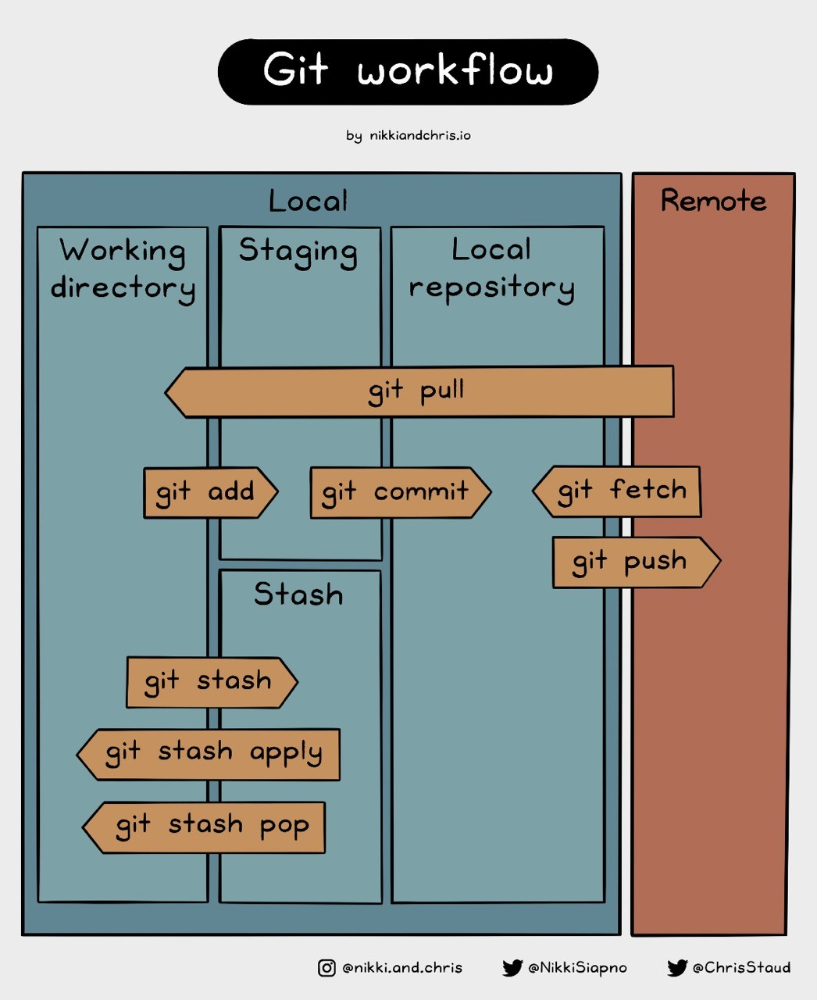
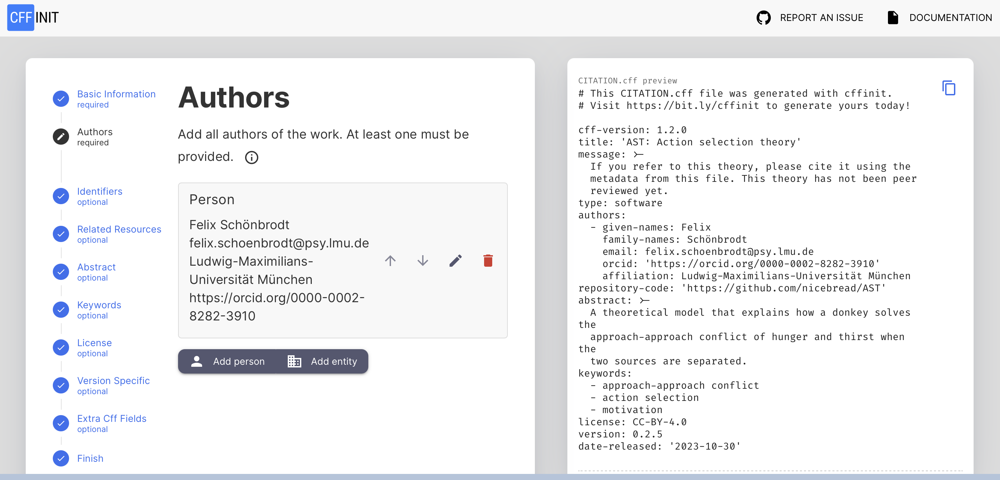
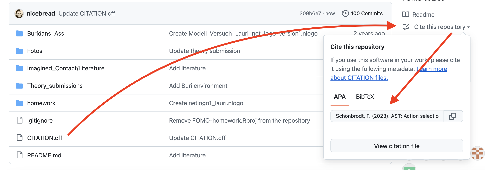
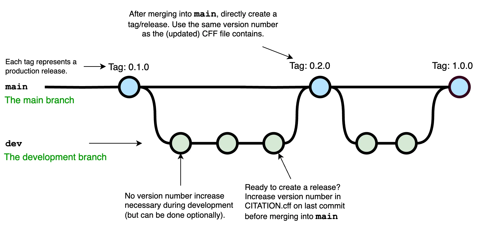

# Git Showcase {background-color="#40666e"}

## Final.doc

{fig-align='center' style='filter: drop-shadow(6px 6px 8px #555555);'}

::: footer
"Piled Higher and Deeper" by Jorge Cham [www.phdcomics.com](https://phdcomics.com)
:::

## Git overview

Git is a tool from software development that solves two major challenges:

1. Tracking changes in source code (or any text files)
   - Keeps a complete version history and allows reverting to previous states.
   - Enables reproducibility by “freezing” project states (releases, tags).
2. How to work collaboratively on the same files.

## Git overview {.stretch}
{fig-align='center' style='filter: drop-shadow(6px 6px 8px #555555);'}

## Git hands-on

::: {.smaller}
1. Showcase how git works
   - Lecturer creates a private project on [Github](http://github.com/) for this course. This will be the central project for submitting homework.
   - Students create their Github accounts; add them as contributors to the course project.
   - Show how to commit, push, pull changes.
   - Show a merge conflict (make a change in the web frontend and locally) and how to resolve it.
2. We start the [OSC git tutorial](https://lmu-osc.github.io/Introduction-RStudio-Git-GitHub/) together to weed out technical hurdles. Aim to get until section "Secure the connection between your computer and GitHub". The rest of tutorial is homework until next week.
   - Note: In chapter "Secure the connection ..." it says "You will then be asked to provide a passphrase. Protecting your keys with a password is optional but highly recommended". I recommend *not* to set a passphrase (just leave it empty), unless you deal with very sensitive data. You will get crazy if you need to enter your passphrase at every SSH operation.
:::


## Never forget ...

{fig-align='center' style='filter: drop-shadow(6px 6px 8px #555555);'}

::: footer
Found on [https://mstdn.games/@64bithero/111251230901866156](https://mstdn.games/@64bithero/111251230901866156)
:::


# CFF citation files {background-color="#40666e"}

## Citation File Format schema version 1.2.0

Tell other users how your theory should be cited, what the current version is, and more meta-data. This can be stored in a file called `CITATION.cff` in the top level folder of your repository (scroll down!):

``` 
cff-version: 1.2.0
title: 'Bystander Effect: A formal model'
message: >-
  If you refer to this model, please cite it using the
  metadata from this file. This theory has not been peer
  reviewed yet.
type: software
authors:
  - given-names: Felix
    family-names: Schönbrodt
    email: felix.schoenbrodt@psy.lmu.de
    orcid: 'https://orcid.org/0000-0002-8282-3910'
    affiliation: Ludwig-Maximilians-Universität München
repository-code: 'https://github.com/nicebread/FOMO-Psy'
abstract: >-
  A formal model that explains why the probability of
  helping behavior decreases with an increasing number
  of passive bystanders.
keywords:
  - fairtheory
  - formal theory
  - bystander effect
license: CC-BY-4.0
version: 0.2.0
date-released: '2025-12-03'
```

## Citation File Format schema version 1.2.0
### How to create

Create an initial version of your `CITATION.cff` file with the [cffinit tool](https://citation-file-format.github.io/cff-initializer-javascript/)

{fig-align='center' style='filter: drop-shadow(6px 6px 8px #555555);'}

## Citation File Format schema version 1.2.0
### How to create


The tool currently only knows "software" and "data set" as types. Create it with type `software` and update the message field: 
 
```
message: >-
  If you refer to this theory, please cite it using the metadata from this file.
type: software 
```

Save the `CITATION.cff` file in the top level folder of your repository.

## Effect of a CITATION.cff file

Both Github and Zenodo (and probably more repositories) parse an existing `CITATION.cff` and display the citation information:

{fig-align='center' style='filter: drop-shadow(6px 6px 8px #555555);'}

## Citation File Format schema version 1.2.0
### Peer review status

- For users of your theory, it is helpful if the peer review status is made explicit.
- This can be done in the `message` field, e.g.:
  - "This theory has not been peer-reviewed yet."
  - If the current version is, say, `2.1.0`: "The last peer-reviewed version was `1.0.4`"
  - "An open peer review of version `1.0.2` is published at doi ..."
- In [future versions of the cff schema](https://github.com/citation-file-format/citation-file-format/issues/455#issuecomment-1729232196), one could also use the `isReviewedBy` annotation of an identifier.


# Folder Structure {background-color="#40666e"}

## Recommended folder structure for our formalization projects

```
.
├── .git (hidden git folder)
├── CHANGELOG.md (record changes between versions here)
├── CITATION.cff
├── My_Model.Rproj (keep the .Rproj file in the top level directory)
├── README.md (this should link to any associated Google docs, if applicable)
├── doc/ (all documentation)
│   ├── VAST_display.drawio
│   ├── tables.pdf (copies of your construct table etc.)
│   └── ...
├── simulation/
│   ├── README.md (specific for the simulations)
│   ├── raw_data/ (a subfolder with empirical raw data, if applicable)
│   │   └── dat.csv
│   ├── plots/
│   │   └── phenomenon1.png
│   ├── 01-functions.R (or any other name)
│   ├── 02-simulations.R
│   ├── 03-analysis.R
│   └── ...
└── manuscript/
    ├── manuscript.qmd	
    └── ...
```
The `git` repository should contain the entire folder structure of your theory project.


# Semantic Versioning {background-color="#40666e"}

## Semantic Versioning (semver)

Version numbers have three numbers: MAJOR.MINOR.PATCH.

Increment the:

- MAJOR version when you make changes that break backward compability
- MINOR version when you add functionality in a backward compatible manner
- PATCH version when you make backward compatible bug fixes

The numbers are plain integers! For example, after 9 comes 10:

`0.9.0 → 0.10.0 → 0.11.0 → 1.0.0 → 1.1.0`

::: footer
See [https://semver.org](https://semver.org) and Van Lissa et al. (2025). To be FAIR: Theory Specification Needs an Update. *Perspectives on Psychological Science*. [https://doi.org/10.1177/17456916251401850](https://doi.org/10.1177/17456916251401850). [Open Access PDF](https://doi.org/10.31234/osf.io/t53np_v3)
:::

## Some rules & conventions:

- The first development version starts with `0.1.0`
- The first stable public release is `1.0.0`
- Once a versioned package has been released, the contents of that version *must not* be modified. Any modifications *must* be released as a new version.
- Major version X (X.y.z) *must* be incremented if any backward incompatible changes are introduced. Patch and minor versions *must* be reset to 0 when the major version is incremented.

## Example

::: {.incremental}
- First commit to repository: `0.1.0`
- Oh, I found and corrected a typo: `0.1.1`
- Implemented a minor new feature (that does not break the functionality of the existing features): `0.2.0`
  - Always reset the *patch* number to zero when increasing the *minor* or *major* number
- By and by, more features get implemented: `0.3.0 → 0.4.0 → ... → 0.12.6`
- Now we are ready to tag our first public release! `0.12.6 → 1.0.0`
- ...
- After years of work and minor version updates (e.g., `1.4.0`), we made a huge change that makes the product incompatible to version 1: `2.0.0`
:::

## Patch, Minor, Major changes

::: {.smaller}
What changes of the theory warrant what kind of version increments?
For theories it makes sense to think in terms of predictions.

- PATCH version when you make backward compatible bug fixes, cosmetic changes, fix spelling errors, or add clarifications
- MINOR version when you expand the set of empirical statements in a backward compatible manner (i.e., the previous version is subsumed within the new version)
  - E.g., you have included more settings your theory covers; added more previously unrecognized variables; became more certain about some predictions (i.e. range predictions became narrower); added more operationalizations for constructs.
- MAJOR version when you commit backwards incompatible changes, i.e., the theory now contains empirical statements that are at odds with a previous version of the theory
  - E.g., you changed core tenets of the definition of constructs or their operationalization, changed the functional relationship between two variables, etc.

Note: The boundaries will not always be clear cut. Think of it not as a precise measurement, but as a useful heuristic to communicate the degree of change in your theory.
:::

## What is a "release" on Github?

Create a *tag* or a *release* whenever a major or minor version is released:

- With tags and releases, you can "pin" and label important commits in your history.
- Users can quickly go to a specific "frozen" version of your repository.
- These releases can be expected to be stable/functional versions of your software or theory (but see also semantic versioning: Everything with a `0.x.x` version probably is not properly tested yet).
- In our context, there is no real difference between *tags* and *releases*, you can use either. 

## Git best practice for recording the version number

::: {.smaller}
The version number is recorded in two places:

1. In the `CITATION.cff` file
2. In the names of all *tags* or *releases*

Is every commit a new version? No, that would be very tedious, especially if you are currently developing the theory and have frequent commits. We recommend:

- Maintain a `dev` developer branch for ongoing development. It is not necessary to update the version number in each development step.
- Whenever a stable stage has been reached:
  - Increase the version number in the `CITATION.cff` file
  - Record the substantive changes in your `CHANGELOG.md`
  - Merge the `dev` branch back into the `main` branch (explained later)
  - Create a *tag*  or *release* on the main branch and write the version number into the label of the tag (see also ["How to create a release?"](#how-to-create-a-release))
:::


## Git best practice

{fig-align='center'}

(of course [more complicated setups](https://github.com/ruhulmus/Git-Flow-Architecture) with multiple branches, e.g. feature branches, are possible).

## Merging branches
### ... in the terminal

Merge a `dev` branch back into `main`:

1. Switch to the `main` branch:
```bash
git checkout main
```

2. Merge the `dev` branch into `main`; provide a short message:

```bash
git merge dev -m "Merge dev into main"
```
(i.e., being in `main` you *pull* the changes from `dev`, not the other way round)

1. 🙏 Pray that no merge conflicts occur. (Hint: If nothing changed on `main` since you created the `dev` branch, there will be no conflicts.)


## How to create a release?

* Use [GitHub's inbuild release mechanism](https://docs.github.com/en/repositories/releasing-projects-on-github/managing-releases-in-a-repository)
* Remember to set the tag to the correct version number
* Copy the content of your `CHANGELOG.md` into the release notes.
* Optional: [create a DOI](https://docs.github.com/de/repositories/archiving-a-github-repository/referencing-and-citing-content) for your release, and archive it with [Zenodo](https://docs.github.com/de/repositories/archiving-a-github-repository/referencing-and-citing-content)
* Optional: update your `CITATION.cff` file to include the new DOI
  * This is a hen/egg problem: The doi will not be in the release itself, as it is assigned only *after* the release.


# FAIR theories {background-color="#40666e"}

## FAIR theories

FAIR =
- Findable
- Accessible
- Interoperable
- Reusable

Originally defined for data (Wilkinson et al., 2016), this concept has been applied to theories (Van Lissa et al., 2025).

::: footer
Van Lissa et al. (2025). To be FAIR: Theory Specification Needs an Update. *Perspectives on Psychological Science*. [https://doi.org/10.1177/17456916251401850](https://doi.org/10.1177/17456916251401850). [Open Access PDF](https://doi.org/10.31234/osf.io/t53np_v3)
:::


<!-- Footer insert below -->
```{r child="../../common/lastslide.qmd"}
```
