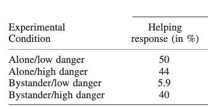

## Overview

| Topic                                               | Duration | Notes |
| --------------------------------------------------- | -------- | ----- |
| Groups work on their formalization                  | 180      |       |
: {.striped}


## Tasks for today

Work on steps on the remaining steps (8-11) of the [Formalization Steps](../formalization_steps.qmd).
You probably won't finish all steps, but the more you achieve, the less you have to do for the final report.

Remember to restrict yourself: Aim for *few* phenomena (ideally, only one) and *simple* theories and models. It gets complicated all by itself!

## How to approach a simulation conceptually

Remember why we do theorizing at all:

**What is a theory good for?** 
Its purpose is to *explain phenomena*, i.e., stable and generalizable patterns in measured data.

**When is a phenomenon explained?**
A phenomenon is explained when a formalized version of a theory produces the statistical pattern representing that phenomenon in a model simulation, showing that if the world were as the theory says, the phenomenon would follow.

Hence, when approaching a simulation ask yourself these questions:

1. What is the phenomenon we want to explain?
   - Express the answer in terms of the manifest (i.e., observable) variables and (if applicable) manipulations in your model
   - Describe the pattern. This typically can be done with the concepts of your statistical toolbox (e.g., a mean difference between groups, a positive relationship between continuous variables). Draw a plot that shows the pattern (e.g., an interaction plot; two box plots showing a mean difference) with clearly labeling the axes - again only using manifest variables that are in your model.
   - It can be fruitful to mimic a prototypical existing study: What did they manipulate and measure? What pattern did they find? How did they visually present the results, and which statistical analysis did they run?
2. Think about randomness / noise in the model
   - We aim for a realistic simulation that mimics real data sets. This requires some randomness / non-deterministic output.
   - Some models already contain randomness, e.g. when a continuous internal variable is transformed into a dichotomous observable output by `rbinom()`.
   - If your model is deterministic, you should start adding (a) interindividual differences and/or (b) random noise. 
   - (a) can be done in the parameters of your functions, or in all non-manipulated exogenous variables (e.g. traits).
   - (b) can be done as a "catch-all" noise term that is added to the final output variable. The amount of noise is arbitrary.
3. Create an input data frame which contains all manipulated and measured exogenous variables. Then use your `psi()` function to compute the output variable. 
   - To make the simulation reproducible, set a seed at the beginning of the script: `set.seed(some_integer_number)`
4. Recreate the plot/results table that you drafted in (1) with the actual simulated data: Does it descriptively recreate the expected pattern?
5. Run the statistical analysis on your simulated data: Is the expected pattern also statistically detectable (i.e., significant)?
6. When your script runs smoothly, repeatedly re-run the simulation with new seeds and see how much the results vary between runs.
7. (optional) Do a statistical power analysis: Create a loop around your simulation script, and let it run 10,000 times. How many of the simulations would have detected the effect with a significant p-value? That is your statistical power.


## How to approach a simulation conceptually: Demonstrated with the Bystander Effect

**1. What is the phenomenon we want to explain?**

- We mimic the study by Fischer et al. ([2006](https://onlinelibrary.wiley.com/doi/10.1002/ejsp.297)), which had 86 participants in a 2 (bystander: yes vs. no) x 2 (danger: low vs. high) experimental design (we ignore the gender factor). Hence, they had around 22 participants in each experimental condition.
- The *danger* condition was pretested on a scale from 0 (not at all dangerous) to 10 (extremely dangerous). The low danger condition had a danger value of $M=6.27$ for the bystander, the high danger condition $M=8.53$.
- The *bystander* condition was manipulated with levels $\text{NOPB}=0$ (alone, no bystander) and $\text{NOPB}=1$ (one bystander)
- Dependent variable: We focus on the "helping response" (observed by experimenter: no=0 or yes=1)

The results in this study were:



The **pattern** is:

- Main effect: Helping is higher when alone compared to 1 bystander
- Interaction: The lowest helping behavior is in the "Bystander/low danger" condition

**2. Think about randomness / noise in the model**

The model already contains two sources of randomness:

- The exogenous internal trait variable `baseResp` ("personal base responsibility: Probability of helping when alone")
- A random process when the internal variable `feltResp` ("felt responsibility for helping") is translated into the observable dichotomous behavior (yes/no) via `rbinom()`

No additional noise is added.

**3. Create an input data frame** which contains all manipulated and measured exogenous variables. Then use your `psi()` function to compute the output variable. 

See the R script [03-simulate](https://github.com/nicebread/Bystander_model_demo/blob/main/simulation/03-simulate.R) in the [Bystander_model_demo repository](https://github.com/nicebread/Bystander_model_demo).

**4. Recreate the plot/result table**: Does it descriptively recreate the expected pattern?

It depends on the sample size (and the random seed). Here is one example with a very large sample size (n=10,000), basically eliminating random error:

```r
  NOPB_factor DoI_factor  helping_response
1 alone       low danger             0.598
2 alone       high danger            0.603
3 bystander   low danger             0.401
4 bystander   high danger            0.457
```

While the specific numbers of course differ from the empirical study, both parts of the pattern could be replicated (main effect for alone > bystander; and bystander/low danger is the lowest).


Here's on virtual sample with n=22 (per group):

```r
  NOPB_factor DoI_factor  helping_response
1 alone       low danger             0.636
2 alone       high danger            0.545
3 bystander   low danger             0.273
4 bystander   high danger            0.591
```

Again, both aspects of the pattern can be found.

**5. Run the statistical analysis on your simulated data**: Is the expected pattern also statistically detectable (i.e., significant)?

Fischer et al. ran a log linear model (LOGIT) on the contingency table. We do a very similar analysis that has been taught in the Statistics 2 lecture: a logistic regression.

Fischer et al. found:
- a significant main effect for danger ($p<.04$): "Less intervention occurred in the condition with low potential danger (31.7%) than in the condition with high potential danger (41.9%)."
- a significant interaction between danger and NOPB ($p < .05$)

**Do we also find the expected 2-way interaction?** This would be the focal test for the hypothesis that "increasing dangerousness diminishes the bystander effect".

- The main effect for NOPB should be negative: more bystanders lead to less helping behavior (also for high levels of dangerousness)
- The interaction effect should be positive: With increasing DoI, the NOPD-effect should get less negative (i.e., more positive)

Here are the results for two simulated samples:

`glm(helpingBeh ~ NOPB * DoI, data = df, family = binomial)`

In n=10,000:

```r
            Estimate Std. Error z value Pr(>|z|)    
(Intercept)  0.42915    0.09819   4.371 1.24e-05 ***
NOPB        -1.51036    0.13840 -10.913  < 2e-16 ***
DoI         -0.03031    0.13123  -0.231    0.817    
NOPB:DoI     1.11416    0.18476   6.030 1.64e-09 ***
```

--> here, both the main effect and the interaction are significant in the expected direction.
Given the huge sample size, we can expect that the coefficients are very close to the true values.

In n=22:

```r
            Estimate Std. Error z value Pr(>|z|)    
(Intercept)    1.640      2.106   0.779   0.4361  
NOPB          -6.483      3.066  -2.115   0.0345 *
DoI           -1.715      2.801  -0.612   0.5404  
NOPB:DoI       7.845      4.058   1.933   0.0532 .
```

--> here, both effects are in the correct direction, but the interaction falls short of significance.
Also note that the coefficients are massively overestimated (e.g., -6.5 vs. -1.5 in the upper simulation).


**6. When your script runs smoothly, repeatedly re-run the simulation with new seeds** and see how much the results vary between runs.

(not shown here)

**7. (optionally) Do a statistical power analysis**: Create a loop around your simulation script, and let it run 10,000 times. How many of the simulations would have detected the effect with a significant p-value? That is your statistical power.

With n=22 per group (as in Fischer et al.), only **7.4%** of all simulated samples showed a significant main effect of NOPB at $p < .05$ - marginally above the chance level of 5%. Hence, the first simulated sample with n=22 (see above) was very lucky to find a significant main effect.
Only **5.5%** showed a significant interaction.

For achieving a power of 80% in the main effect, one would need around 700 participants in each group, any many more for a decent power for the interaction effect.

Of course these power calculations fully depend on the assumed model parameters.


## Deliverable: 

- Increase the version (e.g., to `0.3.0`) in the `CITATION.cff` file.
- Push your current version to the repository.
- Create a tag, give it the version name (e.g., `v0.3.0`) and write a short description for the release.
 
Do these steps regardless whether the theory repository currently is in a "functional state" or still in a messy development version.

