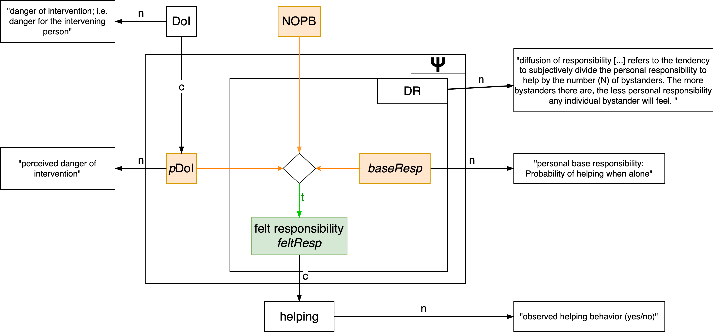

::: {.callout-note collapse="true" title="Instructor notes"}
- Create subfolder `literature` in the [homework repository]() and add van Dongen paper PDF
- Create subfolder `homework/03-Productive_explanations` in the [homework repository]()
:::


## Overview

| Topic                                                              | Duration | Notes                                                 |
| ------------------------------------------------------------------ | -------- | ----------------------------------------------------- |
| Group work: Finalize tables & R implementation of atomic functions | 60       |                                                       |
| Formalization: **Mathematical Models 4**                           | 30       | [Slides](../lectures/MathModel/MathModel.qmd), Step 4 |
| Live coding: Plotting with ggplot2                                 | 10       |                                                       |
| Group work: Create plot for individual functions                   | 40       |                                                       |
: {.striped}


## Live Coding

Here is a self-contained script that shows all steps:

### One possible VAST model
<br><br>


We focus on `feltResp` as outcome variable.

### The code

```{r}
#| echo: true
#---------------------------------------------------------------------
# This is one function in my VAST
# - It has three input variables: baseResp, NOPB, pDoI
# - It has two parameters in the function, which however have been
#   fixed to the values 0.8 and 0.2.
#---------------------------------------------------------------------

#' Compute felt responsibility
#'
#' The base responsibility of "helping when alone" is divided by the
#' number of passive bystanders. The strength of the bystander effect
#' is modulated by the factor alpha, which is itself a function of
#' the perceived danger of intervention. It is an attenuation/boost 
#' factor for the decline/steepness of the 1/x curve. alpha ranges 
#' from 0 to Inf, where 0=no bystander effect (BSE), 1=classical BSE 
#' and values > 1 stronger-than-classical BSEs.
#'
#' @param baseResp The probability to help when one is alone.
#' @param NOPB The number of passive bystanders
#' @param pDoI The perceived danger of intervention (ranging from 0..1)
#' @return The felt responsibility
#'
get_feltResp <- function(baseResp, NOPB, pDoI) {
  alpha <- (0.8 - pDoI*0.8)+0.2
  feltResp <- baseResp / (alpha*NOPB + 1)
  return(feltResp)
}

#---------------------------------------------------------------------
# Prepare data for plotting
#---------------------------------------------------------------------

# define the levels that should be plotted
plot_data <- expand.grid(
  baseResp = c(0.7, 0.8, 0.9),
  NOPB = 0:20,
  pDoI = c(0, 0.5, 1)
)

# nicer labels for facet
plot_data$baseResp_label <- paste("Base resp.:", plot_data$baseResp)

# compute outcome variable
plot_data$feltResp <- get_feltResp(
  baseResp = plot_data$baseResp,
  NOPB = plot_data$NOPB,
  pDoI = plot_data$pDoI
)

#---------------------------------------------------------------------
# Construct the ggplot
#---------------------------------------------------------------------

library(ggplot2)

p1 <- ggplot(plot_data, aes(x=NOPB, y=feltResp, color=factor(pDoI))) +
  geom_line() +
  facet_grid(~ baseResp_label) +
  labs(
    x="Number of passive bystanders",
    y="Felt Responsibility",
    color="Dangerousness \nof Intervention" # \n makes a line break
  ) +
  scale_y_continuous(limits=c(0, 1)) +
  theme_bw()

print(p1)
```


## Homework (individually)

Read: Van Dongen et al. (2024). Productive explanation: A framework for evaluating explanations in psychological science. *Psychological Review*. [https://doi.org/10.1037/rev0000479](https://doi.org/10.1037/rev0000479) (available in the `/literature` folder):

- **Question 1:** What is the role an original author should play when predictions are derived from a theory?
<!-- Answer: None. -->

- **Question 2:** Are phenomena, according to Bogen and Woodward, directly observable?

<!-- Answer: No. Although they are *established* by evidence from observations, they transcend any particular set of structured or unstructured data. -->


- **Question 3:** What are two intermediate processes that are necessary for providing a productive explanation?
  <!-- - **Answer:** "Productive explanation provides a clear connection between a verbal theory and a phenomenon through the use of two intermediaries (a) a formal model that is an explication of the theory and (b) a statistical pattern that represents the phenomenon." (Page 5) -->

- **Question 4:** According to the authors, what are the three steps of productive explanation?
  <!-- - **Answer:** "1. Represent the phenomenon as a statistical pattern, 2. Explicate the verbal theory as a formal model, 3. Evaluate whether the formal model produces the statistical pattern." (Page 5) -->

- **Question 5:** What does the paper identify as a limitation of verbal psychological theories compared to formal models in other scientific disciplines?
  <!-- - **Answer:** "The fact that the theory is purely verbal in character makes it hard to evaluate what exactly is implied by the theory. As a result, it is difficult to assess whether the theory indeed explains a certain phenomenon." (Page 2) -->

- **Question 6:** What criteria are suggested for evaluating the *quality* of explanations in the productive explanation framework?
  <!-- - **Answer:** "The first criterion, precision, refers to the strength of the theoretical anchor between verbal theory and formal model. The second criterion is robustness: it specifies to what extent the formal models consistent with the verbal theory produce the phenomenon. Finally, empirical relevance captures to what extent the theory is necessary for the explanation of the phenomenon." (Page 9) -->

- **Question 7:** Does Model 3 of the Regulatory Resource Theory explain the ego-depletion effect?

<!-- Answer: 
With the specifically chosen parameters: Yes. But it "depends on a quite delicate balance between parameters that characterize the interplay between task demand and willpower." 
 -->


**Deliverable**: Submit answers to the guiding questions as a plain text/markdown file to the course's Github repo (go to `homework/03-Productive_explanations` and upload an `.md` file with your name as filename). You can answer in English or in German. Most questions can be easily answered in one sentence. Feel free to copy and paste the relevant sentences from the paper. 

