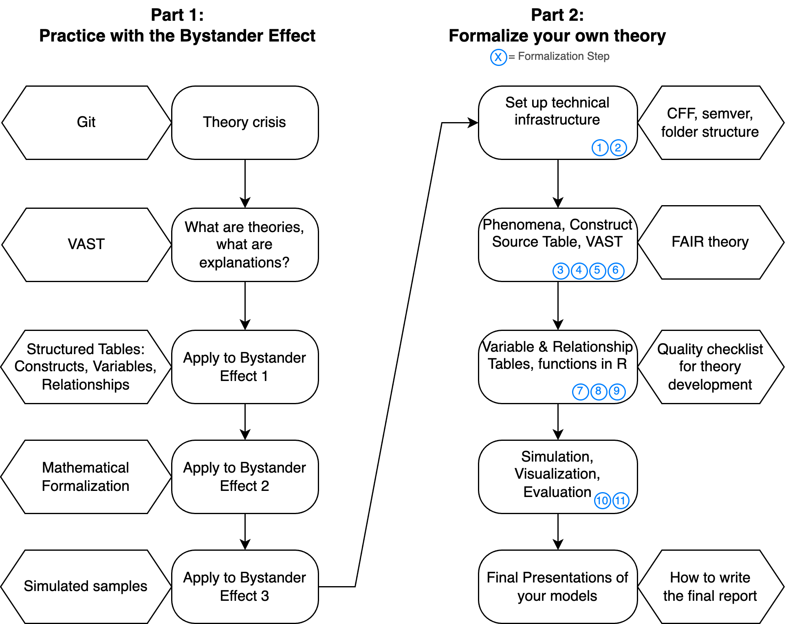

## Overview

| Topic                                                                | Duration           | Notes |
| -------------------------------------------------------------------- | ------------------ | ----- |
| Overview: The second half of the course                              | 10                 |       |
| PhD students present their theoretical frameworks                    | 30 for each theory |       |
| Group Formation: Up to 4 groups                                      | 10                 |       |
| Homework: Read paper for new theory & fill in Construct Source Table |                    |       |
: {.striped}

## Welcome to Part 2!

In the second half, you will repeat all [formalization steps](/Formalization_steps.qmd) that we practiced with the Bystander Effect, but this time you will work on your own formalization project. In parallel, we will learn a few more tools that improve the quality and FAIRness[^1] of your formalization.

[^1]: FAIR = Findable, Accessible, Interoperable, Reusable

## Prototypical formalization styles:

(Reminder, we covered these two prototypical formalization styles in the lecture ["Applying VAST to an existing theory"](../lectures/VAST/VAST_Application.qmd).)

**Narrative Theory Reconstruction (NTR)**: 

- *Starting point*: The existing verbal theory.
- *Main tasks*: Read and understand the narrative theory, then formalize it. Check whether a simulation can produce the target phenomenon.
- *Of only minor importance*: Whether the phenomenon is actually robust.

**Theory Construction Methodology (TCM)**: 

- *Starting point*: A robust phenomenon.
- *Main tasks*: 
  - Understand the phenomenon (its robustness, evidence, moderating conditions, operationalizations; search for meta-analyses). 
  - Invent a new theory that can explain the phenomenon, or use an established theory from another domain and make necessary adjustments (could be within psychology, but also from completely different disciplines).
  - Check whether a formal model of your theory produces the phenomenon. 
- *Of only minor importance*: Any existing theory that aims to explain the phenomenon. You might compare your own formal model to existing theories later.

**Mixture Model**: 

Be inspired by a existing theory, but substantially reduce/extend/change it. 
Focus on a limited set of robust phenomena that the theory should explain.

| Formalization Style / Theory          | PhD A | PhD B | Any other C | ... |
| ------------------------------------- | ----- | ----- | ----------- | --- |
| Narrative Theory Reconstruction (NTR) |       |       |             |     |
| Theory Construction Methodology (TCM) |       |       |             |     |
| Mixture Model                         |       |       |             |     |

## Homework

1. Read the central literature for your theory
2. Create a new Google doc (or other collaborative document) and start a common Construct Source Table
