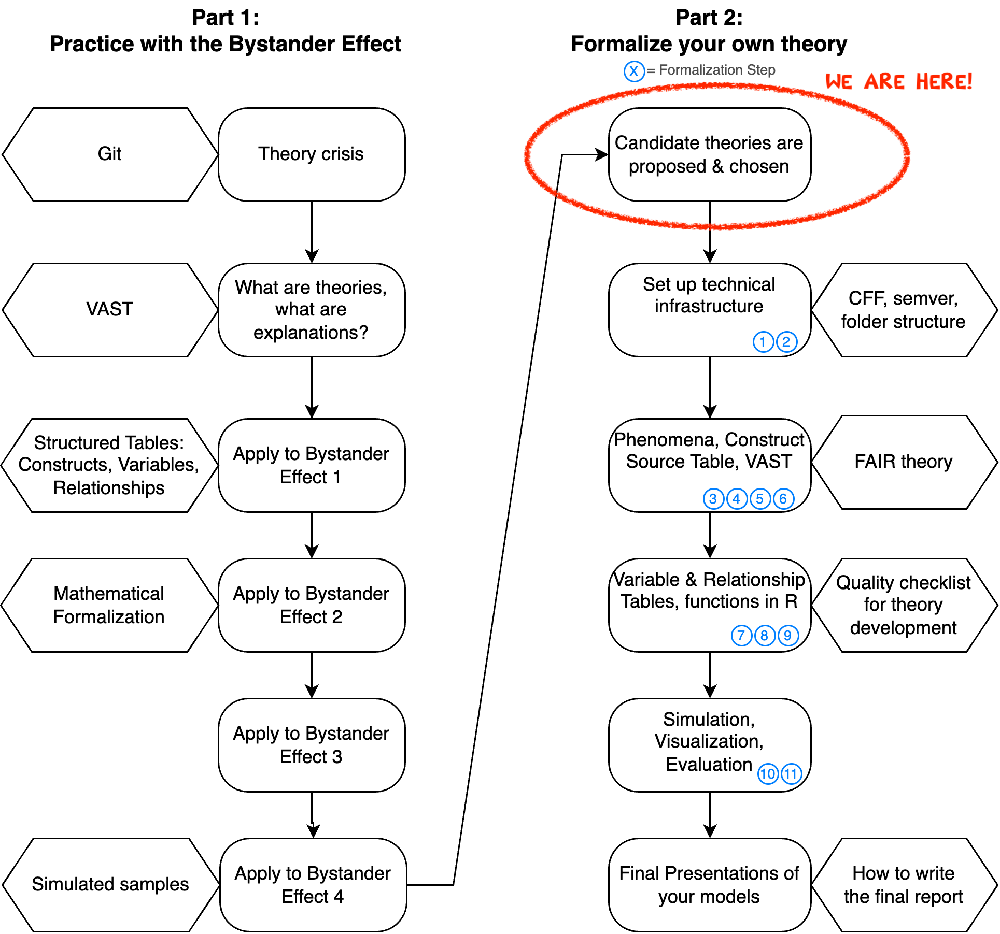

::: {.callout-note collapse="true" title="Instructor notes"}
- Bring 5-6 flip chart sheets and pens
:::

## Overview

| Topic                                                       | Duration           | Notes |
| ----------------------------------------------------------- | ------------------ | ----- |
| Overview: The second half of the course                     | 10                 |       |
| Students propose theories for Part 2                        | 15 for each theory |       |
| World Café/Group Formation                                  | 90                 |       |
| Homework: Read paper for new theory & start Construct Table |                    |       |
: {.striped}

## Welcome to Part 2!

In the second part of the course, you will repeat all [formalization steps](/formalization_steps.qmd) that we practiced with the Bystander Effect, but this time you will work on your own formalization project. In parallel, we will learn a few more tools that improve the quality and FAIRness[^1] of your formalization.

[^1]: FAIR = Findable, Accessible, Interoperable, Reusable

## World Café

**Randomize travel order**: 

1. Prepare the isles with flip-chart paper and pens, write theory names on each flip chart paper.
2. Each student makes up a random order of the letters A, B, C, and D (or more, depending on how many theories we have).
3. Assign letters to theories, write them on the flip chart paper.
4. All proposers of theories then swap (if necessary) two of their letters so that their own theory is *last*. (Because they are going to summarize the discussion at the end.)

**The Café**:

Groups stay 5 min at each isle and discuss the theory, add comments/questions to the board. 
Every group should write something on the board.
Then they move to the next isle, reading the previous comments and adding their own. 
After 4 rounds, the original proposers of each theory (who should be at their own theory isle) summarize the main discussion points.

**The choice**:

Students form 4 groups for Part 2 based on their preferences. It is possible that multiple groups work on different aspects of the same theory.

Maybe students need some room to discuss their choice with their friends, etc. Let them chat for 5-10 min. so that they can achieve a good decision.

## Prototypical formalization styles:

(Reminder, we covered these two prototypical formalization styles in the lecture ["Applying VAST to an existing theory"](../lectures/VAST/VAST_Application.qmd).)

**Narrative Theory Reconstruction (NTR)**: 

- *Starting point*: The existing verbal theory.
- *Main tasks*: Read and understand the narrative theory, then formalize it. Check whether a simulation can produce the target phenomenon.
- *Of only minor importance*: Whether the phenomenon is actually robust.

**Theory Construction Methodology (TCM)**: 

- *Starting point*: A robust phenomenon.
- *Main tasks*: 
  - Understand the phenomenon (its robustness, evidence, moderating conditions, operationalizations; search for meta-analyses). 
  - Invent a new theory that can explain the phenomenon, or use an established theory from another domain and make necessary adjustments (could be within psychology, but also from completely different disciplines).
  - Check whether a formal model of your theory produces the phenomenon. 
- *Of only minor importance*: Any existing theory that aims to explain the phenomenon. You might compare your own formal model to existing theories later.

**Mixture Model**: 

Be inspired by a existing theory, but substantially reduce/extend/change it. 
Focus on a limited set of robust phenomena that the theory should explain.

| Formalization Style / Theory          | PhD A | PhD B | Any other C | ... |
| ------------------------------------- | ----- | ----- | ----------- | --- |
| Narrative Theory Reconstruction (NTR) |       |       |             |     |
| Theory Construction Methodology (TCM) |       |       |             |     |
| Mixture Model                         |       |       |             |     |

## Homework

1. Read the central literature for your theory
2. Create a new Google doc (or other collaborative document) with an empty Construct Table. Optionally start populating the table while reading (will be continued in person in the next session).
